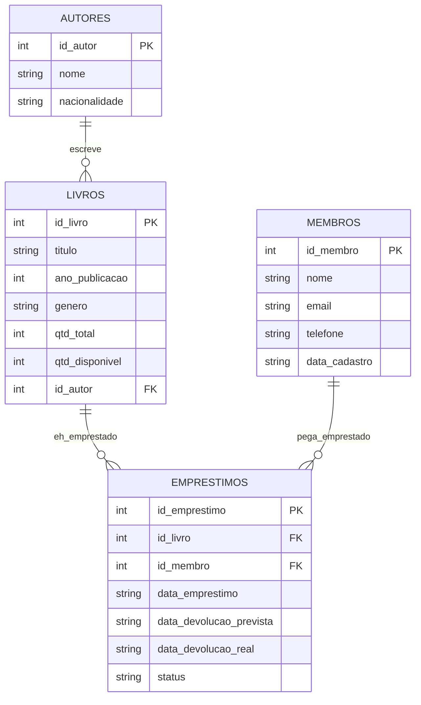

# Sistema de Gerenciamento de Biblioteca

Trabalho de Banco de Dados (NP1).

## Identificação

- Curso: Análise e Desenvolvimento de Sistemas
- Turma: DS4S17
- Integrante: Vinnicius Gabriel Matos Dos Santos - RA H76DJJ6

## Sobre o projeto

Escolhi fazer um sistema de biblioteca. A ideia é simples: tem autores,
tem livros (cada livro é de um autor), tem membros cadastrados e tem os
empréstimos (quem pegou qual livro emprestado).

Regras que implementei:

- Só dá pra emprestar um livro se tiver exemplar disponível (`qtd_disponivel > 0`).
- Quando empresta, a quantidade disponível do livro cai 1. Quando devolve, sobe 1 de novo.
- O prazo de devolução é sempre 7 dias a partir do empréstimo.
- Não dá pra excluir um autor/livro/membro se ele tiver empréstimo vinculado (o banco bloqueia isso sozinho por causa da FK).
- A quantidade disponível nunca pode passar da quantidade total (tem um CHECK no banco garantindo isso).

O sistema faz CRUD completo (criar, listar, editar, excluir) em autores,
livros e membros. Em empréstimos não faz sentido "editar" um registro já
feito, então o CRUD lá é: criar (emprestar), listar, atualizar (devolver) e
excluir.

Tecnologia usada:

- Banco: SQLite
- Back-end: Python puro, só com `sqlite3` e `http.server` (nada de Flask/Django, sem ORM, só SQL mesmo)
- Front-end: HTML, CSS, JS, jQuery e Bootstrap pelo CDN. Sem React nem nada assim.

## Modelagem de dados

Diagrama do banco:



O script de criação das tabelas está em `database/schema.sql` (tem as 4
tabelas com PK, FK e as restrições). Tem também um `database/seed.sql`
com uns dados de exemplo só pra não abrir tudo vazio.

## Como rodar

Só precisa ter Python 3 instalado, não precisa instalar nenhuma
biblioteca (não usei nada de fora da biblioteca padrão).

1. Clonar o repositório:
   ```
   git clone https://github.com/vinnisntos/sql-fernando.git
   cd sql-fernando
   ```

2. Rodar o servidor:
   ```
   cd backend
   python server.py
   ```
   (no Windows, se não funcionar, tenta `py server.py`)

3. Na primeira vez que roda, ele já cria o `database/biblioteca.db`
   sozinho, com as tabelas e os dados de exemplo.

4. Abrir http://localhost:8000 no navegador.

5. Pra parar o servidor é só dar Ctrl+C no terminal.

## Estrutura

```
sql-fernando/
├── database/
│   ├── schema.sql
│   └── seed.sql
├── backend/
│   ├── server.py
│   ├── db.py
│   ├── autores.py
│   ├── livros.py
│   ├── membros.py
│   └── emprestimos.py
├── frontend/
│   ├── index.html, autores.html, livros.html, membros.html, emprestimos.html
│   ├── css/style.css
│   └── js/
└── docs/
    └── prints/
```

## Prints do sistema funcionando

Estão na pasta `docs/prints`:

1. `01-pagina-inicial.jpg` - página inicial
2. `02-autores-listagem.jpg` - listagem de autores
3. `03-livros-listagem.jpg` - listagem de livros
4. `04-membros-listagem.jpg` - listagem de membros
5. `05-emprestimos-vazio.jpg` - tela de empréstimos antes de emprestar nada
6. `06-emprestimo-registrado.jpg` - depois de registrar um empréstimo
7. `07-persistencia-qtd-disponivel.jpg` - mostra o livro "Dom Casmurro" com a quantidade disponível caindo de 3 pra 2 depois do empréstimo (prova que persiste no banco)
